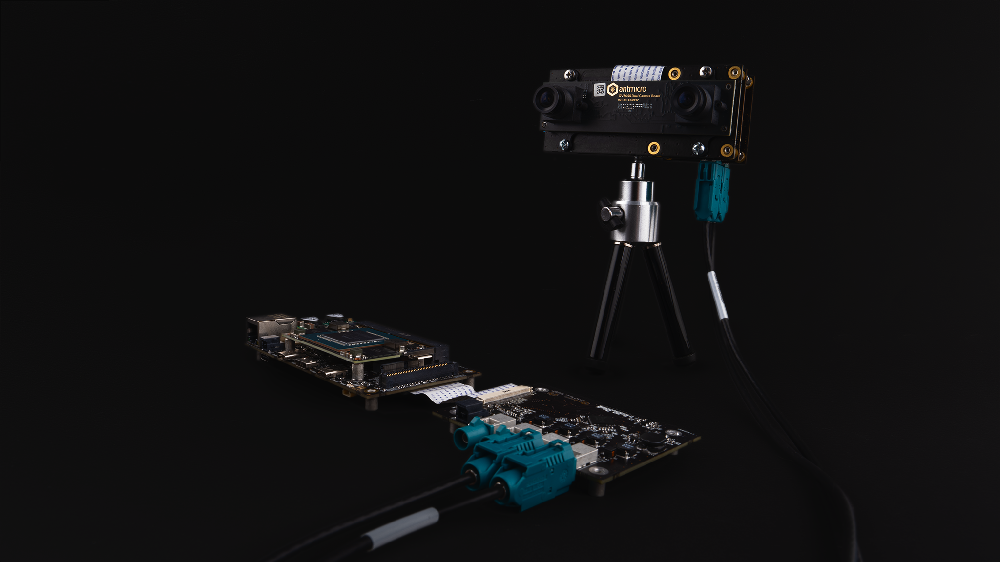
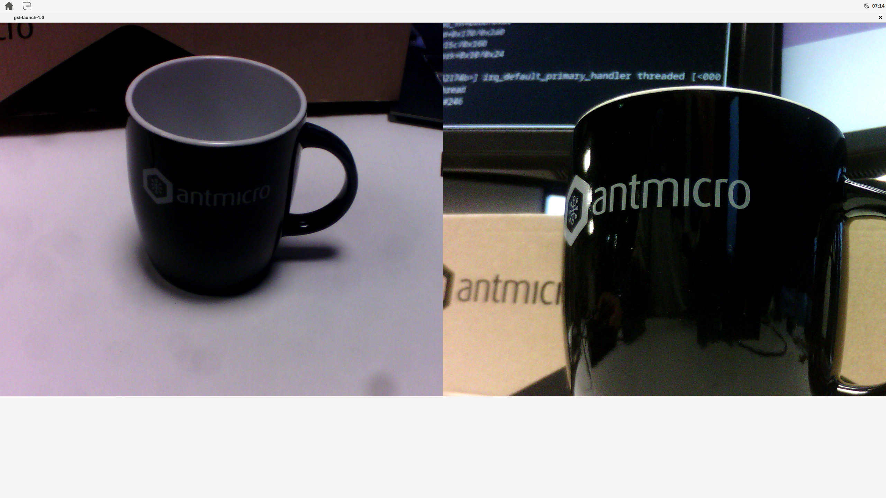

# `Jetson Orin Baseboard GMSL OV5640` demo

Copyright (c) 2022-2025 [Antmicro](https://www.antmicro.com)
`nvidia-jetson-orin-baseboard-gmsl-ov5640-demo` lets you build a Board Support Package you can run on [the open hardware Jetson Orin Baseboard](https://github.com/antmicro/jetson-orin-baseboard). It supports a dual camera over GMSL setup consisting of:
* Two OV5640 cameras on a [Antmicro OV5640 Dual Camera board](https://github.com/antmicro/ov5640-dual-camera-board),
* [Dual Camera to GMSL Serializer CSI Adapter](https://github.com/antmicro/dual-gmsl-serializer-adapter),
* Two [GMSL Serializer boards](https://github.com/antmicro/gmsl-serializer)
* One [GMSL Deserializer board](https://github.com/antmicro/gmsl-deserializer)

## Building the image

You can fetch all necessary code with:

<!-- name="fetch-repo"; transformer="echo "$TUTTEST_INPUT" | sed "/repo init/s/.*/& -b $CI_COMMIT_REF_NAME/" | sed "$ a repo forall meta-antmicro -c 'git checkout $CI_COMMIT_REF_NAME'"" -->
```sh
mkdir orin-baseboard-demo && cd orin-baseboard-demo
repo init -u https://github.com/antmicro/meta-antmicro.git -m demos/nvidia-jetson-orin-baseboard-gmsl-ov5640-demo/manifest.xml
repo sync -j`nproc`
```

To start building the BSP, run the following commands:

<!-- name="build-bsp" -->
```sh
source sources/poky/oe-init-build-env
bitbake nvidia-jetson-orin-baseboard-demo
```

When the build process is complete, the resulting image will be stored at  `build/tmp/deploy/images/p3509-a02-p3767-0000/nvidia-jetson-orin-baseboard-demo-p3509-a02-p3767-0000.tegraflash.tar.gz`.

## Preparing the hardware setup

To prepare the setup, please follow the steps outlined in the following sections of the [Jetson Orin Baseboard Getting started guide](https://antmicro.github.io/jetson-orin-baseboard/getting_started.html#):
* [Collect the hardware](https://antmicro.github.io/jetson-orin-baseboard/getting_started.html#collect-the-hardware)
* [Build your setup](https://antmicro.github.io/jetson-orin-baseboard/getting_started.html#build-your-setup)

In addition to that, the following hardware will be needed to complete the demo setup:
* [Antmicro OV5640 Dual Camera board](https://github.com/antmicro/ov5640-dual-camera-board)
* [Dual Camera to GMSL Serializer CSI Adapter](https://github.com/antmicro/dual-gmsl-serializer-adapter)
* Two [GMSL Serializer boards](https://github.com/antmicro/gmsl-serializer)
* [GMSL Deserializer board](https://github.com/antmicro/gmsl-deserializer)
* 50-pin FFC cable


To prepare the Jetson Orin Baseboard for GMSL usage, connect the hardware like in the diagram above, that is:

1. Connect GMSL Deserializer to Jetson Orin Baseboard on CSI A
2. Connect GMSL Serializer #1 to GMSL Deserializer on Channel A
3. Connect GMSL Serializer #2 to GMSL Deserializer on Channel B
4. Connect GMSL Serializer #1 to the dual camera adapter
5. Connect GMSL Serializer #2 to the dual camera adapter
6. Connect OV5640 Dual Camera Board to the dual camera adapter
7. Plug in the power supply to the GMSL Deserializer
8. Power on the Jetson Orin Baseboard

This is how the setup should look after everything has been connected:



## Flashing the image to the board

To flash the image, please follow the [Flash the BSP image](https://antmicro.github.io/jetson-orin-baseboard/getting_started.html#flash-the-bsp-image) instructions, with one difference: instead of downloading the BSP image file in the "Get the BSP image" step, use the one available at `build/tmp/deploy/images/p3509-a02-p3767-0000/nvidia-jetson-orin-baseboard-demo-p3509-a02-p3767-0000.tegraflash.tar.gz`.

## Accessing the cameras

The BSP comes with pre-installed software to test video streaming from the cameras. GMSL sensors require some initial configuration which is detailed in this section.

### Verify that GMSL was initialized

Run the following command on the device to verify that the GMSL hardware was detected:
```
$ media-ctl -p
```
It's output should reflect the GMSL devices' topology:
```
...
- entity 1: nvcsi0 (2 pads, 2 links)
            type V4L2 subdev subtype Unknown flags 0
            device node name /dev/v4l-subdev0
	pad0: Sink
		<- "des_ch_0":0 [ENABLED]
	pad1: Source
		-> "vi-output, ov5640 21-003c":0 [ENABLED]

- entity 4: nvcsi1 (2 pads, 2 links)
            type V4L2 subdev subtype Unknown flags 0
            device node name /dev/v4l-subdev1
	pad0: Sink
		<- "des_ch_1":0 [ENABLED]
	pad1: Source
		-> "vi-output, ov5640 23-003c":0 [ENABLED]

- entity 7: ser_0_ch_0 (2 pads, 2 links)
            type V4L2 subdev subtype Unknown flags 0
            device node name /dev/v4l-subdev2
	pad0: Source
		[fmt:FIXED/0x0]
		-> "des_ch_0":1 [ENABLED]
	pad1: Sink
		[fmt:YUYV8_1X16/0x0]
		<- "ov5640 21-003c":0 [ENABLED]

- entity 10: ser_1_ch_0 (2 pads, 2 links)
             type V4L2 subdev subtype Unknown flags 0
             device node name /dev/v4l-subdev3
	pad0: Source
		[fmt:FIXED/0x0]
		-> "des_ch_1":1 [ENABLED]
	pad1: Sink
		[fmt:YUYV8_1X16/0x0]
		<- "ov5640 23-003c":0 [ENABLED]

- entity 13: des_ch_0 (2 pads, 2 links)
             type V4L2 subdev subtype Unknown flags 0
             device node name /dev/v4l-subdev4
	pad0: Source
		[fmt:YUYV8_1X16/0x0]
		-> "nvcsi0":0 [ENABLED]
	pad1: Sink
		[fmt:FIXED/0x0]
		<- "ser_0_ch_0":0 [ENABLED]

- entity 16: des_ch_1 (2 pads, 2 links)
             type V4L2 subdev subtype Unknown flags 0
             device node name /dev/v4l-subdev5
	pad0: Source
		[fmt:YUYV8_1X16/0x0]
		-> "nvcsi1":0 [ENABLED]
	pad1: Sink
		[fmt:FIXED/0x0]
		<- "ser_1_ch_0":0 [ENABLED]

- entity 19: ov5640 21-003c (1 pad, 1 link)
             type V4L2 subdev subtype Sensor flags 0
             device node name /dev/v4l-subdev6
	pad0: Source
		[fmt:UYVY8_1X16/1920x1080 field:none colorspace:srgb]
		-> "ser_0_ch_0":1 [ENABLED]

- entity 21: vi-output, ov5640 21-003c (1 pad, 1 link)
             type Node subtype V4L flags 0
             device node name /dev/video0
	pad0: Sink
		<- "nvcsi0":1 [ENABLED]

- entity 47: ov5640 23-003c (1 pad, 1 link)
             type V4L2 subdev subtype Sensor flags 0
             device node name /dev/v4l-subdev7
	pad0: Source
		[fmt:UYVY8_1X16/1920x1080 field:none colorspace:srgb]
		-> "ser_1_ch_0":1 [ENABLED]

- entity 49: vi-output, ov5640 23-003c (1 pad, 1 link)
             type Node subtype V4L flags 0
             device node name /dev/video1
	pad0: Sink
		<- "nvcsi1":1 [ENABLED]
```

### Setting up formats

Deserializer and serializer need to be informed what packet types to forward, otherwise all packets will be filtered:
```sh
# first sensor
media-ctl -d /dev/media0 --set-v4l2 '"ser_0_ch_0":1[fmt:YUYV8_1X16/1920x1080]'
media-ctl -d /dev/media0 --set-v4l2 '"des_ch_0":0[fmt:YUYV8_1X16/1920x1080]'
# second sensor
media-ctl -d /dev/media0 --set-v4l2 '"ser_1_ch_0":1[fmt:YUYV8_1X16/1920x1080]'
media-ctl -d /dev/media0 --set-v4l2 '"des_ch_1":0[fmt:YUYV8_1X16/1920x1080]'
```

### Capturing frames

To test capturing frames from the camera just run:

```sh
camera_number="0"
number_of_frames="10"
v4l2-ctl -d $camera_number --stream-mmap --stream-count=$number_of_frames --stream-to=frames.raw
```
Or use GStreamer:
```sh
camera_device="/dev/video0"
number_of_frames="10"
gst-launch-1.0 v4l2src device=$camera_device num-buffers=$number_of_frames ! filesink location=frames.raw
```

For OV5640 number of frames should be at least 3, since this sensor needs a few frames to roll out before the stream stabilizes.

### Live preview

This requires Jetson Orin Baseboard to be connected to an HDMI display.
To stream the feed from a camera to an X11 window:

```sh
camera_device="/dev/video0"
gst-launch-1.0 v4l2src device=$camera_device ! xvimagesink
```

To capture two feeds simultaneously:

```sh
gst-launch-1.0 \
v4l2src device=/dev/video1 ! \
compositor name=mix sink_0::xpos=0 sink_0::ypos=0 sink_1::xpos=1280 sink_1::ypos=0 ! \
videoconvert ! autovideosink \
v4l2src device=/dev/video0 ! \
mix.

```

Example of a live preview:



